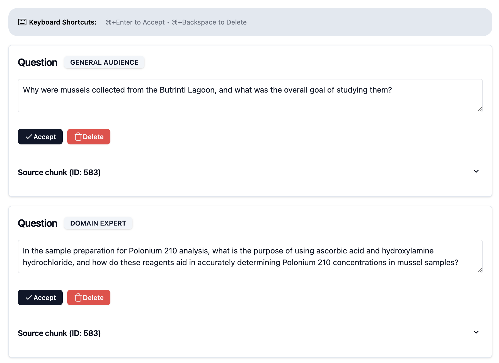
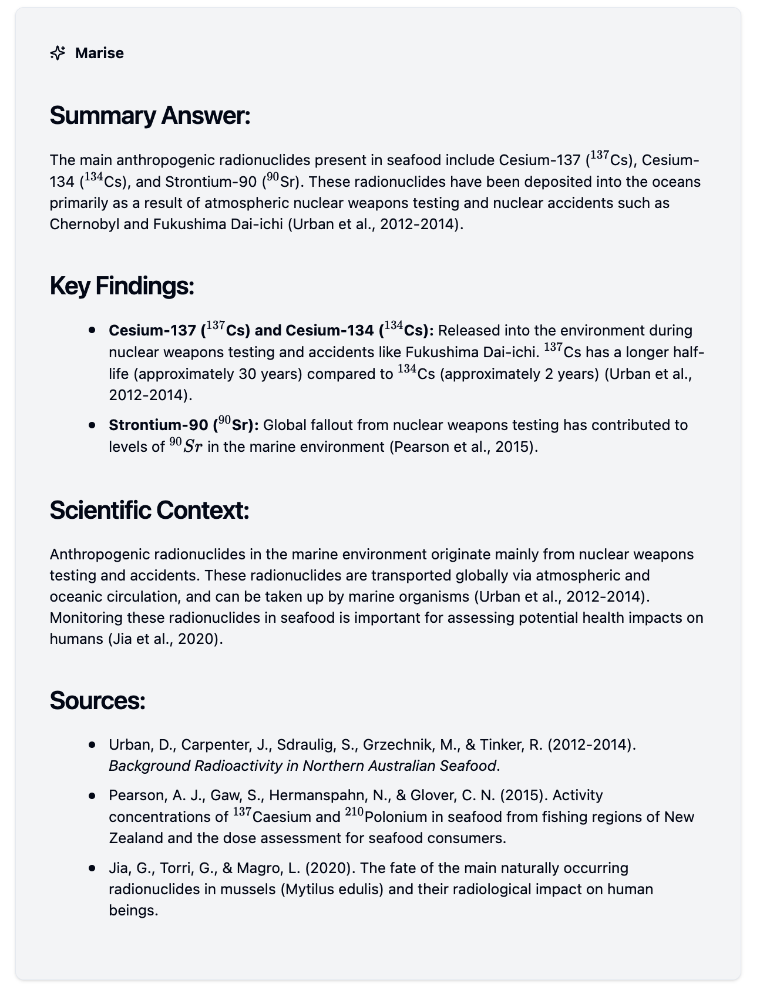

When most people think of the [International Atomic Energy Agency (IAEA)](https://www.iaea.org), they picture inspectors in protective gear examining nuclear facilities. Few realize that tucked away in Monaco, IAEA scientists are quietly building one of the world's most comprehensive databases on marine radioactivity. The Marine Radioactivity Information System (MARIS) contains hundreds of academic papers tracking radioactivity in our oceans - vital information for environmental monitoring, research, and public safety.

But how do you make such specialized knowledge accessible to both experts and the general public? Enter Retrieval-Augmented Generation (RAG) - the AI approach everyone's talking about but few are implementing at scale. This post documents our ongoing journey to build a RAG system for MARIS, including the unexpected challenges, pragmatic solutions, and evaluation methods we've developed along the way.

## What is MARIS

Deep in the Mediterranean coastline of Monaco sits an IAEA laboratory that few people know about. Here, scientists manage what might be one of the most comprehensive databases of marine radioactivity in the world: the [Marine Radioactivity Information System (MARIS)](https://maris.iaea.org).

MARIS serves as a global repository for measurements of radioactivity in our oceans. It contains data from thousands of samples collected across the world's seas - everything from seawater and marine sediments to fish, seaweed, and other marine organisms. For over 20 years, the IAEA has been collecting, verifying, and standardizing this data, making it available to researchers, policymakers, and environmental scientists.

Why does this matter? Radioactivity in our oceans comes from both natural sources and human activities - from nuclear power plant operations to historical weapons testing. Understanding these levels helps scientists track environmental changes, assess potential risks, and establish baselines for what's "normal" in different marine environments.

But MARIS isn't just a database of numbers. Behind those measurements are more than 500 academic papers - detailed scientific studies explaining how the measurements were taken, what they mean, and how they fit into our broader understanding of marine ecosystems. This knowledge base is constantly growing as new research emerges.

The challenge we faced was clear: How do we make this treasure trove of specialized scientific knowledge accessible to everyone who might need it? A government official with no scientific background might need to understand radioactivity trends in their coastal waters. A marine biologist might need detailed information about specific isotopes in certain species. A student might be researching environmental impacts of nuclear energy.

Traditional search methods fall short with such specialized content. Keyword searches miss semantic connections. Manual browsing is impractical given the volume and complexity of the papers. And the technical nature of the content creates barriers for non-specialists.

This is where our RAG implementation journey began - with the goal of transforming MARIS from a specialized database accessible mainly to experts into a knowledge system that could respond to natural language questions from users of all backgrounds, providing accurate, sourced information tailored to their level of expertise.

## The Unexpected PDF Parsing Challenge

When we first outlined our RAG implementation roadmap, PDF parsing seemed like a mere checkbox item - a technical necessity but hardly a major challenge. After all, converting documents to text is a solved problem, right? As it turns out, this assumption couldn't have been further from reality.

Academic papers on marine radioactivity aren't simple text documents. They're complex publications with two-column layouts, tables packed with isotope measurements, specialized scientific figures, equations, footnotes, and references. What looks visually organized to the human eye becomes a parsing nightmare for machines.

Our first attempts at using standard PDF extraction libraries produced text that resembled a jigsaw puzzle assembled by a blindfolded person. Sentences from adjacent columns merged mid-thought. Tables transformed into unintelligible character soup. Figure captions appeared randomly in the middle of paragraphs. And critical data - the very information we needed most - was often mangled beyond recognition.

We quickly realized that poor-quality text extraction would poison our entire RAG pipeline. No matter how sophisticated our embedding model or how well-tuned our retrieval system, if the source text was garbled, our results would be unreliable.

After evaluating several OCR solutions, **Mistral OCR** emerged as our champion, offering the best quality-to-cost ratio for scientific content. It proved remarkably capable at:

- Accurately recognizing scientific notation, including superscripts and subscripts
- Preserving the complex two-column layouts of academic papers
- Extracting figures as separate elements
- Converting tables into properly formatted markdown
- Rendering equations and isotope names in LaTeX format

This significantly streamlined our parsing pipeline, but our work wasn't done. We still needed to implement:

1. **Content Sanitization**: We developed processes to remove irrelevant content like repetitive journal names, page numbers, phone numbers in footers, and other artifacts that would add noise to our retrieval system.

2. **Figure and Table Processing**: Rather than keeping raw tables and figures, we replaced them with rich descriptions generated by an LLM. For figures, we used a prompt like:

```
Please describe figure '{im_fname.name}' in the context of this academic paper.
Extract its caption and provide a description detailed enough to be useful for a RAG system.
When describing the figure, also consider its surrounding to further contextualize it.
Analyse the image and syntesize the main findings as well as main trends if any.
Always use latex to express nuclide names.
If you notice that the figure is a logo from the journal, simply ignore it
```

This approach transformed visual data into textual descriptions that could be embedded and retrieved alongside the main text. For example, a graph showing cesium concentrations in different fish species would be described with all relevant trends and data points, ensuring this information remained accessible through text-based retrieval.

3. **Metadata Enrichment**: During parsing, we extract key metadata like sample types, geographic locations, isotopes studied, and measurement methodologies - information that helps with later retrieval.

The combination of Mistral OCR's powerful baseline capabilities with our custom post-processing created a robust pipeline that transformed complex scientific PDFs into clean, structured text while preserving the scientific integrity of the original content.

For anyone implementing RAG systems for scientific literature, our advice is clear: invest in quality OCR and don't underestimate the importance of post-processing. The parsing stage isn't just a technical prerequisite - it's the foundation upon which your entire system rests.

## Chunking Strategy and Evolution

With our parsing pipeline delivering high-quality text, we faced the next critical decision: how to divide our documents into chunks for embedding and retrieval. This seemingly simple decision has profound implications for retrieval quality.

For our initial implementation, we opted for a straightforward approach: a sliding window of 800 tokens with 50% overlap. This means each chunk contains about 800 tokens (roughly 600 words), and consecutive chunks share half their content. We chose this conservative strategy to get our RAG pipeline operational quickly and begin collecting performance metrics.

While simple, this approach offers several advantages:
- It ensures concepts that might span chunk boundaries aren't lost
- It provides context continuity between chunks
- It's computationally efficient and easy to implement

However, we're well aware that more sophisticated chunking strategies exist:

- **Semantic chunking**: Dividing text based on semantic units like paragraphs, sections, or topics rather than arbitrary token counts
- **Hierarchical chunking**: Creating chunks at multiple levels of granularity (document, section, paragraph)
- **Recursive chunking**: Breaking documents into progressively smaller pieces based on content structure
- **Late chunking**: A particularly intriguing approach detailed in [Isaac Flath's excellent blog post](https://isaacflath.com/blog/blog_post?fpath=posts%2F2025-04-08-LateChunking.ipynb)

The late chunking strategy is especially compelling for our use case. Instead of pre-chunking documents before embedding, this approach embeds entire documents or large sections first. Then, at query time, it dynamically extracts the most relevant passages from these larger embedded units. This preserves more context and potentially improves retrieval accuracy, particularly for complex scientific content where concepts often span multiple paragraphs.

As we move beyond our initial implementation, we plan to experiment with late chunking and evaluate whether it improves performance on our specific corpus of scientific papers. Our approach to chunking, like every aspect of our RAG system, will evolve based on empirical evidence from our evaluation metrics.

For now, our simple sliding window approach gives us a solid baseline to measure future improvements against. And as we'll see in the next section, having a robust evaluation framework is crucial for making informed decisions about these technical choices.

## Evaluating Retrieval: Metrics That Matter

If there's one lesson we've learned from implementing RAG systems, it's this: **you can't improve what you don't measure**. While many RAG implementations focus exclusively on the final output quality, we recognized early that a systematic evaluation framework would be essential for iterative improvement.

### Why Evaluate the Retrieval Step?

The retrieval component is the linchpin of any RAG system. No matter how sophisticated your generation model, it can only work with the context it's given. If the retrieval fails to surface relevant information, even the most advanced LLM will produce inadequate answers.

This is especially critical for scientific content, where rigor matters and hallucinations can be particularly problematic. Our approach focuses on evaluating the retrieval component independently before assessing the full system.

### Synthetic Question Generation

To evaluate retrieval effectively, we need a ground truth dataset of questions paired with the chunks that should be retrieved to answer them. But how do you create such a dataset without extensive manual annotation?

Our solution: synthetic question generation. For each chunk in our corpus, we prompt an LLM to generate questions that:

1. Can be answered using only the information in that chunk
2. Vary in complexity and phrasing
3. Represent realistic user queries
4. Include both factual and analytical questions

We carefully engineered our question generation prompt to ensure diversity, avoiding simplistic questions that merely repeat keywords from the chunk. The goal is to create questions that test the semantic understanding capabilities of our embedding model, not just keyword matching.

Each synthetic question is paired with its source chunk as the ground truth - the chunk that should ideally be retrieved when this question is asked. Authorized users can then review and refine generated questions as shown in [Fig. 1](#fig-1):

<!-- <figure id="fig-1">
    
    <figcaption>Fig. 1: Example of MARIS RAG UI to review and validate synthetic questions</figcaption>
</figure> -->

{#fig-1}


### Comprehensive Retrieval Metrics

With our synthetic question-chunk pairs established, we implemented a robust evaluation framework using multiple complementary metrics:

#### Recall@k

We calculate Recall@k across a wide range of k values (from 1 to 40). This measures the percentage of questions where the ground truth chunk appears within the top-k retrieved chunks. By examining this metric at different cutoff points, we can understand both the relevancy of our top results and the overall coverage of our retrieval system.

#### Mean Reciprocal Rank (MRR)

While Recall tells us if the relevant chunk appears somewhere in our results, MRR helps us understand where it typically appears. For each question, we identify the rank position of the ground truth chunk and calculate the reciprocal (1/rank). If the ground truth appears first, the score is 1; if second, 0.5; if third, 0.33, and so on. We then average these scores across all questions.

MRR is particularly valuable for our use case because it quantifies the likelihood that relevant information will be prominently positioned in the context provided to the generation model. A higher MRR indicates that correct information is not just present but prioritized.

### Scientific Approach to System Design

We've approached our RAG implementation as a scientific experiment, systematically testing different configurations to identify optimal performance. Our evaluation framework allows us to compare:

- Different retrieval methods (vector search, full-text search, hybrid approaches)
- Various embedding models of different sizes and architectures
- The impact of rerankers on result quality
- Different chunking strategies and sizes

Each combination is evaluated using our metrics suite, with results tracked in a dashboard that allows us to identify clear performance trends. This methodical approach ensures that every architectural decision is backed by empirical evidence rather than assumptions or industry trends.

In future blog posts, we'll dive deeper into specific findings from these experiments, including our detailed analysis of vector vs. hybrid search performance and the impact of rerankers on scientific content retrieval.

### Implementation and Automation

We've integrated this evaluation framework directly into our development workflow:

1. A dedicated evaluation pipeline generates synthetic questions from a representative sample of chunks
2. Questions are reviewed by domain experts to ensure quality and relevance
3. Automated testing runs these questions through different retrieval configurations
4. Results are tracked in a dashboard that shows performance trends over time

By establishing this rigorous evaluation framework early in our implementation, we've been able to make continuous, measurable improvements to our system rather than relying on subjective assessments or anecdotal feedback.

## Prompt Engineering for Scientific Content

The final piece of our RAG implementation puzzle was crafting prompts that would effectively bridge the gap between technical scientific content and diverse user needs. Prompt engineering for scientific RAG systems differs significantly from general-purpose applications, particularly when working with specialized content like marine radioactivity research.

### Balancing Relevance with Accessibility

Our system needed to serve both domain experts and the general public, requiring prompts that could adapt to different levels of technical understanding. We developed a two-tier approach:

1. **Retrieval prompts** optimized for semantic understanding of scientific concepts
2. **Generation prompts** designed to transform technical content into appropriate responses

The generation component proved particularly challenging due to several unique requirements of scientific communication.

### Legal and Ethical Considerations

Working with academic papers raised important copyright considerations. Our prompts needed to ensure the system would:

- Properly attribute information to original authors
- Avoid verbatim reproduction of substantial portions of papers
- Transform content in ways that add educational value
- Maintain scientific accuracy while paraphrasing

Here's an excerpt from our generation prompt that addresses these concerns:

```
RESPONSE REQUIREMENTS
Attribution
- Always cite the source of information in your responses
- Include author names, publication year, title, and journal/publisher where available
- Format: (Author et al., Year, "Title", Journal/Source)
- When synthesizing from multiple sources, cite each source that contributed to your answer

Content Transformation
- Paraphrase and synthesize information rather than reproducing exact text
- Limit direct quotations to short, necessary passages (maximum 2-3 sentences)
- When quoting, use quotation marks and provide precise citation
- Focus on communicating core concepts, findings, and facts rather than reproducing text
```

<!-- <figure id="fig-2">
    
    <figcaption>Fig. 2: Example of a response to the following question: "What are the main anthropogenic radionuclides present in seafood?"</figcaption>
</figure> -->
{#fig-2}


### Scientific Accuracy and Uncertainty

Another critical aspect of our prompt engineering was maintaining scientific rigor. Our prompts instruct the model to:

- Distinguish between established scientific consensus and emerging findings
- Clearly communicate uncertainty when present
- Acknowledge limitations in the knowledge base
- Use proper scientific notation, particularly for isotopes and measurements

### Structured Response Format

To enhance usability, we implemented a structured response format that helps users quickly find the information they need:

```
### Summary Answer: Brief, synthesized response to the query
### Key Findings: Core information points relevant to the question
### Scientific Context: How this information fits within broader understanding
### Sources: Properly formatted citations for all information provided
```

This format ensures that users can immediately see a concise answer while having access to supporting details and proper citations if needed.

### Iterative Refinement

Our prompt engineering process wasn't a one-time effort but an iterative cycle:

1. We developed initial prompts based on our understanding of user needs and scientific communication standards
2. We tested these prompts against a diverse set of queries
3. Domain experts reviewed responses for accuracy, attribution, and appropriateness
4. We refined prompts based on this feedback
5. We repeated the cycle until performance met our standards

This approach allowed us to identify and address subtle issues, such as the system occasionally using outdated terminology or struggling with certain types of scientific notation.

### Metadata Extraction Prompts

Beyond response generation, we also developed specialized prompts for metadata extraction during the document processing phase. These prompts help identify key information like:

- Geographic locations of sampling
- Specific isotopes studied
- Measurement methodologies
- Marine organism species
- Temporal ranges of studies

This extracted metadata enriches our chunks and improves retrieval accuracy for specific technical queries.

The careful engineering of these various prompts has been essential to creating a system that not only retrieves relevant information but presents it in a way that is scientifically accurate, properly attributed, and accessible to different user groups.

## Early Results and Lessons Learned

After several months of development, our MARIS RAG system has reached an important milestone. We've successfully implemented a complete pipeline from PDF parsing to response generation, with a robust evaluation framework to guide our continued improvements.

### Promising Initial Performance

Even with our relatively straightforward initial approach, we're seeing encouraging results:

- **70% Recall@10** using hybrid search (combining vector and keyword search) with OpenAI's text-embedding-3-small model and no reranker
- **Clean, properly attributed responses** that maintain scientific accuracy while being accessible to different user groups
- **Successful handling of complex scientific queries** about marine radioactivity data

These results validate our approach and provide a solid foundation for further refinement. The fact that we're achieving good retrieval performance even without advanced techniques like reranking suggests significant room for improvement as we implement more sophisticated components.

### The Value of Measurement-First Development

Perhaps the most valuable outcome of this first phase has been establishing our evaluation framework. By prioritizing metrics before optimization, we've created a development environment where every decision can be guided by empirical evidence rather than intuition.

This approach has already helped us avoid several potential pitfalls. For instance, when considering different chunking strategies, our metrics revealed that our simple sliding window approach was outperforming more complex semantic chunking in certain scenarios - a counterintuitive finding we would have missed without systematic measurement.

### Looking Ahead

While this blog post has outlined our overall workflow and approach, we've only scratched the surface of the technical details. In upcoming posts, we'll dive deeper into specific components and share our findings on:

1. **Scaling to the full MARIS knowledge base** - We've focused initially on biota samples, but plan to expand to the complete corpus covering seawater, sediment, and suspended matter

2. **Fine-tuning for scientific content** - We'll explore fine-tuning embedding models and rerankers specifically for marine radioactivity literature, again leveraging synthetic data generation

3. **User segmentation and adaptation** - Different user groups (scientists, policymakers, journalists, students) have distinct needs. We'll share our approach to tailoring responses based on user expertise and intent

4. **Error analysis and continuous improvement** - We'll establish processes for monitoring performance, identifying failure patterns, and implementing targeted improvements

## Conclusion

Building a RAG system for specialized scientific content presents unique challenges, from PDF parsing complexities to the need for rigorous scientific accuracy. Our journey with MARIS has reinforced that successful implementation requires both technical expertise and domain knowledge.

By sharing our approach, challenges, and early results, we hope to contribute to the growing body of knowledge around practical RAG implementations. As we continue to refine our system, we'll provide updates on our progress and insights that may help others tackling similar challenges.

The potential impact of making specialized scientific knowledge more accessible extends far beyond our specific use case. As more organizations implement similar systems for their domain-specific knowledge bases, we may see a democratization of expertise that accelerates scientific progress and informed decision-making.

*Our application is now accessible at [https://marise-dev.pla.sh](https://marise-dev.pla.sh) (currently by request only), where users can not only query the system but also provide feedback and annotations that help us continually improve performance.*

## Technology Stack

While we've focused primarily on methodology in this post, our implementation relies on several key technologies that have proven invaluable:

- [Mistral OCR](https://mistral.ai/fr/news/mistral-ocr) for high-quality scientific PDF parsing
- [Gemini-2-0-flash](https://ai.google.dev/gemini-api) for structured extraction and description of figures and tables
- [LanceDB](https://docs.lancedb.com/enterprise/introduction) as our vector database for efficient similarity search
- [FastHTML](https://www.fastht.ml) for creating and serving our web application


## Learning Resources

For those interested in building similar systems, several resources have been particularly valuable in our journey:

- [Isaac Flath's blog](https://isaacflath.com) for practical RAG implementation insights and FastHTML
- Jason Liu's course on [Systematically Improving RAG Applications](https://maven.com/applied-llms/rag-playbook) - while not inexpensive, it provided a structured approach that accelerated our development
- [Phil Schmid's guide on structured extraction with Gemini](https://www.philschmid.de/gemini-pdf-to-data)
- [J. Howard & Answer.ai's team "How to Solve It With Code" course](https://solveit.fast.ai)